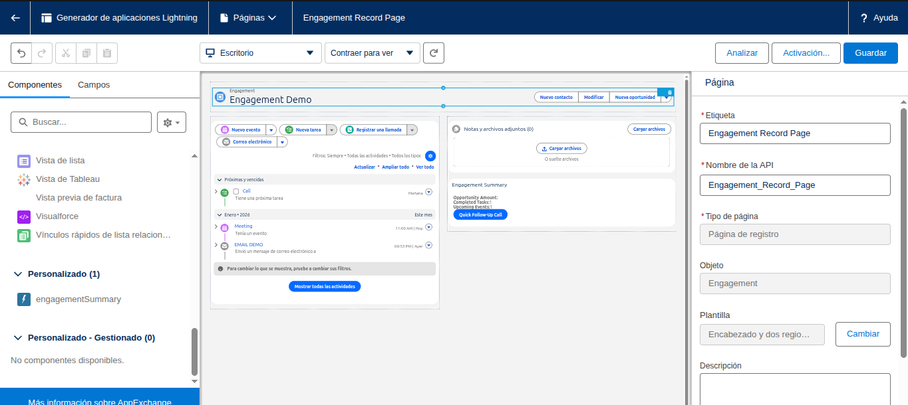
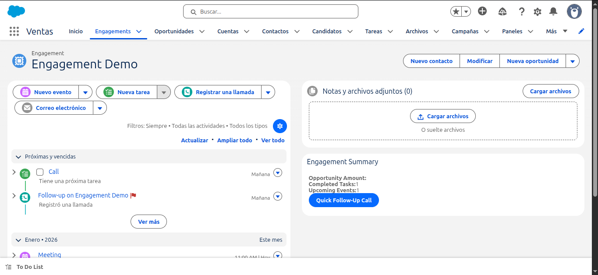
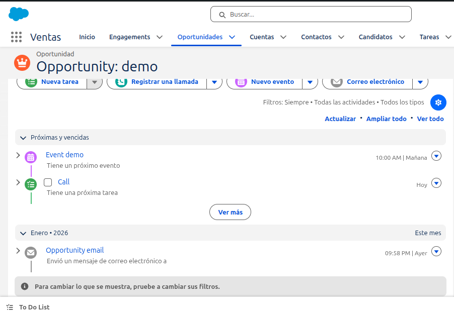
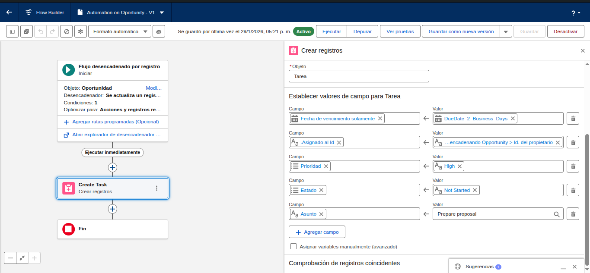
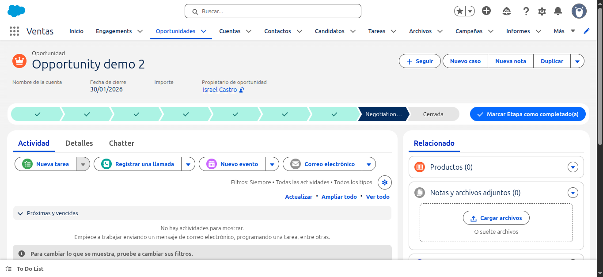
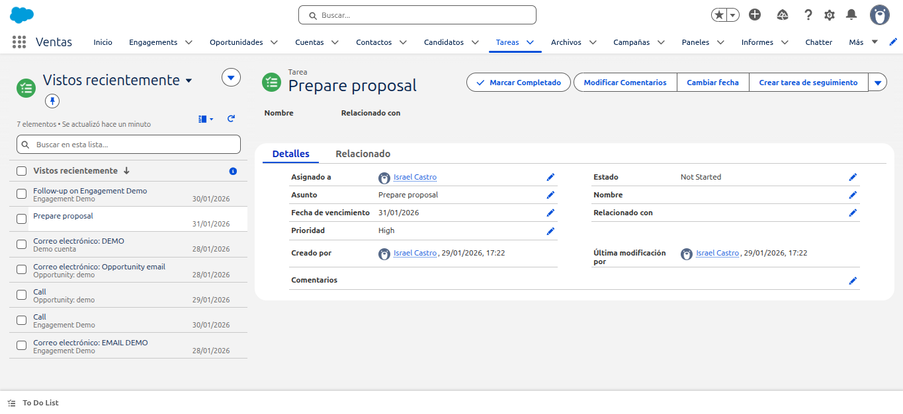
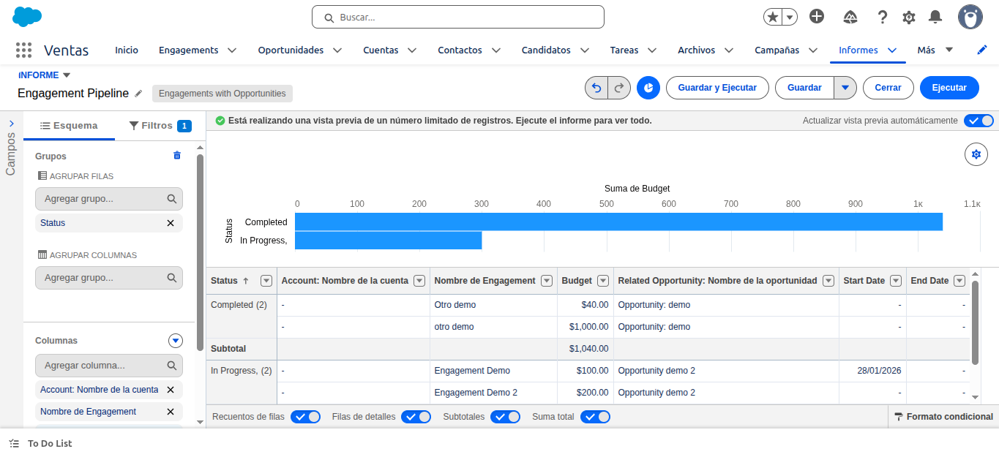
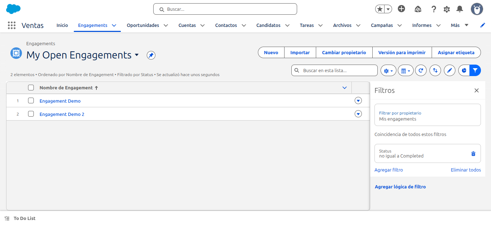
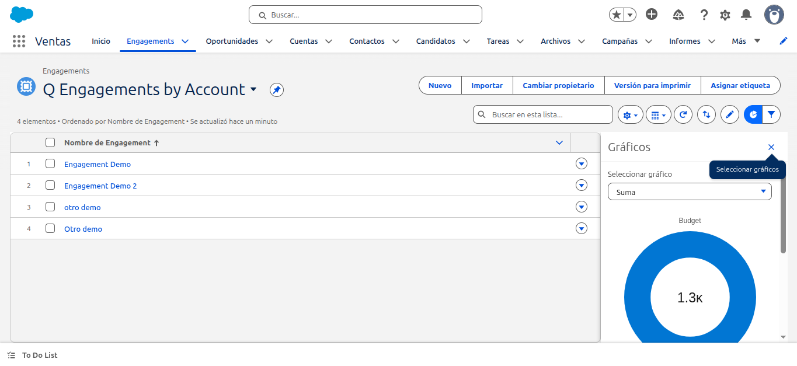

# Salesforce Engagement Assignment

## Overview
Engagement management solution built using Salesforce configuration, automation, reporting, LWC, and Apex.

## What was built
- **Custom Object:** Engagement related to Account, Contact, and Opportunity  
- **Flow:** Record-triggered on Opportunity  
  - Fires when Stage = *Negotiation/Review*
  - Creates a Task on the related Engagement (*Prepare proposal*, High priority, due in 2 business days)
- **LWC:** `engagementSummary` on Engagement record page  
  - Shows Opportunity Amount, completed Tasks count, upcoming Events count  
  - Button **Quick Follow-Up Call** creates a Call Task due tomorrow
- **Apex:** Aggregates Tasks and Events for the LWC
- **Reporting & Views:**
  - Report: **Engagement Pipeline** (chart by Status and Opportunity Amount)
  - List Views: **My Open Engagements**, **Engagements by Account**

## Assumptions
- Engagement may exist without an Opportunity  
- Business days exclude weekends only  
- Standard Salesforce permissions are available  

## How to test (Items #3–#8)
1. Create an Engagement linked to an Account and Opportunity  
2. Add Tasks and Events to the Engagement  
3. Open the Engagement record and verify the LWC  
4. Click **Quick Follow-Up Call**  
5. Change Opportunity Stage to *Negotiation/Review*  
6. Run the **Engagement Pipeline** report  
7. Check Engagement list view charts  

## Code
- **LWC:** `force-app/main/default/lwc/engagementSummary`
- **Apex:** `force-app/main/default/classes/EngagementSummaryController.cls`

## Reports & List Views
- Report Type: **Engagements with Opportunities**
- Report: **Engagement Pipeline**
- List Views:
  - **My Open Engagements**
  - **Engagements by Account**

---

## Screenshots / Evidence
Screenshots are included in the `/screenshots` folder and demonstrate:
1. Engagement record page with the LWC component

2. Logging a call, email, or event

3. The Flow firing (Task created automatically)

4. The Engagement Pipeline report with chart

5. Engagement list view chart

